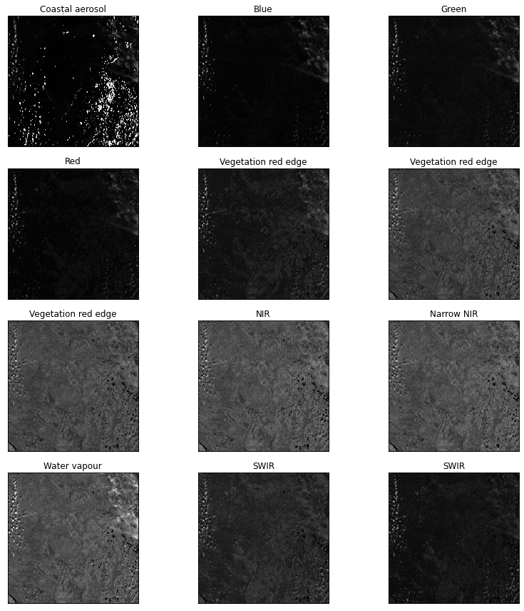
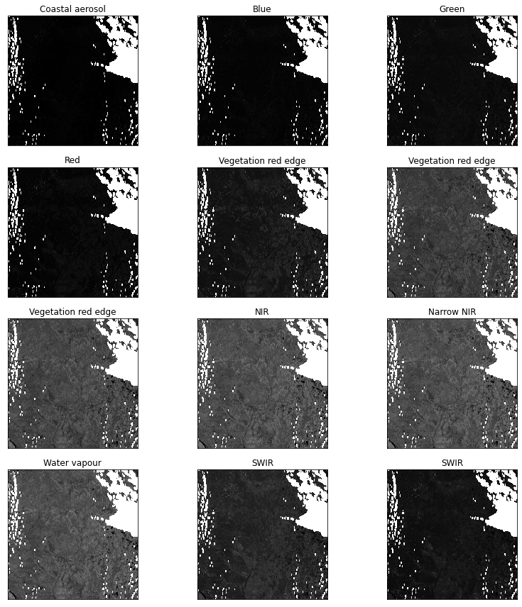

# Quickstart

Remote sensing data can be used for many purposes - for vegetation, climate, soil and human impact analysis. RSP can prepare raw remote sensing data for analysis.
 
Here is an example of some features that RSP provides. In this example we will use Sentinel-2 and ESA landcover data to create a model for land cover classification. 

Sentinel-2 images are being preprocessed and merged into a mosaic, NDVI of that Sentinel-2 mosaic is calculated. Landcover images are merged into mosaic at the same resolution and projection as Sentinel-2 data. Then Sentinel-2 and landcover data is divided into tiles and U-Net model that predicts landcover based on Sentinel-2 data is trained. This model is used to create landcover map. 

## Importing RSP

Here we import Remote Sensing Processor
```
import remote_sensing_processor as rsp
```

## Sentinel-2 preprocessing

We have 6 Sentinel-2 images that cover our region of interest.
```
>>> from glob import glob
>>> sentinel2_imgs = glob('/home/rsp_test/sentinels/*.zip')
>>> print(sentinel2_imgs)
['/home/rsp_test/sentinels/L1C_T42VWR_A032192_20210821T064626.zip',
 '/home/rsp_test/sentinels/L1C_T42WXS_A032192_20210821T064626.zip',
 '/home/rsp_test/sentinels/L1C_T43VCL_A032192_20210821T064626.zip',
 '/home/rsp_test/sentinels/L1C_T43VDK_A031391_20210626T063027.zip',
 '/home/rsp_test/sentinels/L1C_T43VDL_A023312_20210823T063624.zip',
 '/home/rsp_test/sentinels/L1C_T43VDL_A031577_20210709T064041.zip']
```
We need to preprocess these images. Preprocessing includes converting L1 products to L2, superresolution for 20 and 60m bands and cloud masking.

First step of preprocessing is converting L1 raw product to atmospherically corrected L2 product. It is done with Sen2Cor algorythm.


Image from [here](https://doi.org/10.3390/rs12050833)

Second step is upscaling 20-m and 60-m bands to 10-m resolution with superresolution model.


Image from [here](https://doi.org/10.1016/j.isprsjprs.2018.09.018)

Final step is cloud masking. It is done with cloud mask file from sentinel image, surface type map generated during Sen2Cor L2 product generation and with band 1 and 9 filters.

Sentinel image before masking



Sentinel image after cloud masking.



`sentinel2` function can take list of images as input and process all of them one by one.

```
>>> output_sentinels = rsp.sentinel2(sentinel2_imgs)
Preprocessing of /home/rsp_test/sentinels/L1C_T42VWR_A032192_20210821T064626.zip completed
Preprocessing of /home/rsp_test/sentinels/L1C_T42WXS_A032192_20210821T064626.zip completed
Preprocessing of /home/rsp_test/sentinels/L1C_T43VCL_A032192_20210821T064626.zip completed
Preprocessing of /home/rsp_test/sentinels/L1C_T43VDK_A031391_20210626T063027.zip completed
Preprocessing of /home/rsp_test/sentinels/L1C_T43VDL_A023312_20210823T063624.zip completed
Preprocessing of /home/rsp_test/sentinels/L1C_T43VDL_A031577_20210709T064041.zip completed
>>> print(output_sentinels)
['/home/rsp_test/sentinels/L1C_T42VWR_A032192_20210821T064626/',
 '/home/rsp_test/sentinels/L1C_T42WXS_A032192_20210821T064626/',
 '/home/rsp_test/sentinels/L1C_T43VCL_A032192_20210821T064626/',
 '/home/rsp_test/sentinels/L1C_T43VDK_A031391_20210626T063027/',
 '/home/rsp_test/sentinels/L1C_T43VDL_A023312_20210823T063624/',
 '/home/rsp_test/sentinels/L1C_T43VDL_A031577_20210709T064041/']
```

Function returns list of folders with preprocessed images.

## Merging Sentinel-2 images
In this stage preprocessed Sentinel-2 images are being merged into one mosaic. This function can merge not only single-band images, but also multi-band imagery like Sentinel-2.  `clipper` argument is a path to a file with a border of our region of interest which is used to clip mask, `projection` is a CRS we need, and `nodata_order` is to merge images in order from images with most nodata values on bottom (they usually are most distorted and cloudy) to images with less nodata on top (they are usually clear).
```
>>> border = '/home/rsp_test/border.gpkg'
>>> mosaic_sentinel = rsp.mosaic(output_sentinels, '/home/rsp_test/mosaics/sentinel/', clipper = border, projection = 'EPSG:4326', nodata_order = True)
Processing completed
>>> print(mosaic_sentinel)
['/home/rsp_test/mosaics/sentinel/B1.tif',
 '/home/rsp_test/mosaics/sentinel/B2.tif',
 '/home/rsp_test/mosaics/sentinel/B3.tif',
 '/home/rsp_test/mosaics/sentinel/B4.tif',
 '/home/rsp_test/mosaics/sentinel/B5.tif',
 '/home/rsp_test/mosaics/sentinel/B6.tif',
 '/home/rsp_test/mosaics/sentinel/B7.tif',
 '/home/rsp_test/mosaics/sentinel/B8.tif',
 '/home/rsp_test/mosaics/sentinel/B8A.tif',
 '/home/rsp_test/mosaics/sentinel/B9.tif',
 '/home/rsp_test/mosaics/sentinel/B11.tif',
 '/home/rsp_test/mosaics/sentinel/B12.tif']
```
The function returns list of band mosaics.


## Calculating NDVI for sentinel-2 mosaic

Normalized difference function can automatically select bands for calculating NDVI based on Sentinel-2 image, we can just give it index name and a folder where bands are stored.
```
>>> ndvi = rsp.normalized_difference('NDVI', '/home/rsp_test/mosaics/sentinel/')
>>> print(ndvi)
'/home/rsp_test/mosaics/sentinel/NDVI.tif'
```

## Merging ESA-landcover files

We have 3 rasters of [ESA World Cover landcover](https://esa-worldcover.org/). We need it to use as a target values in a training process.
```
>>> lcs = glob('/home/rsp_test/landcover/*.tif')
>>> print(lcs)
['/home/rsp_test/landcover/ESA_WorldCover_10m_2020_v100_N60E075_Map.tif',
 '/home/rsp_test/landcover/ESA_WorldCover_10m_2020_v100_N63E072_Map.tif',
 '/home/rsp_test/landcover/ESA_WorldCover_10m_2020_v100_N63E075_Map.tif']
```
We need to merge and clip them. To use Sentinel-2 and ESA landcover data together, we need to bring Landcover data to same resolution and projection as Sentinel-2 data. So we use one of Sentinel mosaic bands as a reference file using `reference_raster` argument.

```
>>> mosaic_landcover = rsp.mosaic(lcs, '/home/rsp_test/mosaics/landcover/', clipper = border, reference_raster = '/home/rsp_test/mosaics/sentinel/B1.tif', nodata = -1)
Processing completed
>>> print(mosaic_landcover)
['/home/rsp_test/mosaics/landcover/ESA_WorldCover_10m_2020_v100_N60E075_Map_mosaic.tif']
```
The function returns list of band mosaics.

## Cutting data to tiles


The goal of this tutorial is to create a model that predict land cover classes (y data) based on Sentinel-2 imagery (x data). We will use Convolutional Neural Network (CNN) for this task. CNN takes tiles of same size as input and process them one by one or unite them into mini-batches.

Here we define x data (that will be used by CNN as input training data) and y data (that will be used as target value).
```
>>> x = mosaic_sentinel
>>> y = mosaic_landcover[0]
```
We will cut Sentinel (x) and landcover (y) data to 256x256 px tiles (`tile_size = 256`). To have lower bias we will random shuffe tiles (`shuffle = True`). To evaluate model performance on a data that was not used in model training we will split data into train, validation and test subsets in proportion 3 to 1 to 1 (`split = [3, 1, 1]`) and ignoring tiles with only nodata values (`nodata = -1`). Landcover data have 10 classes, and one class is for nodata. We need to define number of classes to convert landcover data to categorical format (`num_classes = 11`).
```
>>> x_i, y_i, tiles, samples = rsp.generate_tiles(x, y, num_classes = 11, tile_size = 256, shuffle = True, split = [3, 1, 1], nodata = -1)
>>> x_train = x_i[0]
>>> x_val = x_i[1]
>>> x_test = x_i[2]
>>> y_train = y_i[0]
>>> y_val = y_i[1]
>>> y_test = y_i[2]
```

The function returns list of x datasets (x train, x validation and x test), list of y datasets, list of random shuffled samples and list of tile coordinates.

## Training U-Net CNN

Here we are training U-Net CNN that predicts landcover class based on sentinel imagery.


Here we define model architecture.
```
# training U-Net that predicts landcover class based on sentinel imagery
from tensorflow import keras

from tensorflow.keras import layers, models, optimizers

inputs = layers.Input(shape = (256, 256, 12))

conv1 = layers.Conv2D(64, (3, 3), padding = 'same', kernel_initializer = 'he_normal')(inputs)
norm1 = layers.BatchNormalization()(conv1)
relu1 = layers.Activation('relu')(norm1)
conv1 = layers.Conv2D(64, (3, 3), padding = 'same', kernel_initializer = 'he_normal')(relu1)
norm1 = layers.BatchNormalization()(conv1)
relu1 = layers.Activation('relu')(norm1)
pool1 = layers.MaxPooling2D(pool_size=(2, 2))(relu1)
drop1 = layers.Dropout(0.1)(pool1)

conv2 = layers.Conv2D(128, (3, 3), padding = 'same', kernel_initializer = 'he_normal')(drop1)
norm2 = layers.BatchNormalization()(conv2)
relu2 = layers.Activation('relu')(norm2)
conv2 = layers.Conv2D(128, (3, 3), padding = 'same', kernel_initializer = 'he_normal')(relu2)
norm2 = layers.BatchNormalization()(conv2)
relu2 = layers.Activation('relu')(norm2)
pool2 = layers.MaxPooling2D(pool_size=(2, 2))(relu2)
drop2 = layers.Dropout(0.1)(pool2)

conv3 = layers.Conv2D(256, (3, 3), padding = 'same', kernel_initializer = 'he_normal')(drop2)
norm3 = layers.BatchNormalization()(conv3)
relu3 = layers.Activation('relu')(norm3)
conv3 = layers.Conv2D(256, (3, 3), padding = 'same', kernel_initializer = 'he_normal')(relu3)
norm3 = layers.BatchNormalization()(conv3)
relu3 = layers.Activation('relu')(norm3)
pool3 = layers.MaxPooling2D(pool_size=(2, 2))(relu3)
drop3 = layers.Dropout(0.1)(pool3)

conv4 = layers.Conv2D(512, (3, 3), padding = 'same', kernel_initializer = 'he_normal')(drop3)
norm4 = layers.BatchNormalization()(conv4)
relu4 = layers.Activation('relu')(norm4)
conv4 = layers.Conv2D(512, (3, 3), padding = 'same', kernel_initializer = 'he_normal')(relu4)
norm4 = layers.BatchNormalization()(conv4)
relu4 = layers.Activation('relu')(norm4)
pool4 = layers.MaxPooling2D(pool_size=(2, 2))(relu4)
drop4 = layers.Dropout(0.1)(pool4)

conv5 = layers.Conv2D(1024, (3, 3), padding = 'same', kernel_initializer = 'he_normal')(drop4)
norm5 = layers.BatchNormalization()(conv5)
relu5 = layers.Activation('relu')(norm5)
conv5 = layers.Conv2D(1024, (3, 3), padding = 'same', kernel_initializer = 'he_normal')(relu5)
norm5 = layers.BatchNormalization()(conv5)
relu5 = layers.Activation('relu')(norm5)

up6 = layers.Conv2DTranspose(512, (2, 2), strides = (2, 2), padding = 'same', kernel_initializer = 'he_normal')(relu5)
merge6 = layers.concatenate([relu4,up6], axis = 3)
drop6 = layers.Dropout(0.1)(merge6)
conv6 = layers.Conv2D(512, (3, 3), padding = 'same', kernel_initializer = 'he_normal')(drop6)
norm6 = layers.BatchNormalization()(conv6)
relu6 = layers.Activation('relu')(norm6)
conv6 = layers.Conv2D(512, (3, 3), padding = 'same', kernel_initializer = 'he_normal')(relu6)
norm6 = layers.BatchNormalization()(conv6)
relu6 = layers.Activation('relu')(norm6)

up7 = layers.Conv2DTranspose(256, (2, 2), strides = (2, 2), padding = 'same', kernel_initializer = 'he_normal')(relu6)
merge7 = layers.concatenate([relu3,up7], axis = 3)
drop7 = layers.Dropout(0.1)(merge7)
conv7 = layers.Conv2D(256, (3, 3), padding = 'same', kernel_initializer = 'he_normal')(drop7)
norm7 = layers.BatchNormalization()(conv7)
relu7 = layers.Activation('relu')(norm7)
conv7 = layers.Conv2D(256, (3, 3), padding = 'same', kernel_initializer = 'he_normal')(relu7)
norm7 = layers.BatchNormalization()(conv7)
relu7 = layers.Activation('relu')(norm7)

up8 = layers.Conv2DTranspose(128, (2, 2), strides = (2, 2), padding = 'same', kernel_initializer = 'he_normal')(relu7)
merge8 = layers.concatenate([relu2,up8], axis = 3)
drop8 = layers.Dropout(0.1)(merge8)
conv8 = layers.Conv2D(128, (3, 3), padding = 'same', kernel_initializer = 'he_normal')(drop8)
norm8 = layers.BatchNormalization()(conv8)
relu8 = layers.Activation('relu')(norm8)
conv8 = layers.Conv2D(128, (3, 3), padding = 'same', kernel_initializer = 'he_normal')(relu8)
norm8 = layers.BatchNormalization()(conv8)
relu8 = layers.Activation('relu')(norm8)

up9 = layers.Conv2DTranspose(64, (2, 2), strides = (2, 2), padding = 'same', kernel_initializer = 'he_normal')(relu8)
merge9 = layers.concatenate([relu1,up9], axis = 3)
drop9 = layers.Dropout(0.1)(merge9)
conv9 = layers.Conv2D(64, (3, 3), padding = 'same', kernel_initializer = 'he_normal')(drop9)
norm9 = layers.BatchNormalization()(conv9)
relu9 = layers.Activation('relu')(norm9)
conv9 = layers.Conv2D(64, (3, 3), padding = 'same', kernel_initializer = 'he_normal')(relu9)
norm9 = layers.BatchNormalization()(conv9)
relu9 = layers.Activation('relu')(norm9)

conv10 = layers.Conv2D(11, (1, 1), activation = 'softmax', padding = 'same')(relu9)
model = models.Model(inputs = inputs, outputs = conv10)
model.compile(optimizer = optimizers.Adam(learning_rate=0.01),
loss = 'categorical_crossentropy',
metrics=[tf.keras.metrics.CategoricalAccuracy(name='accuracy'),
	     tf.keras.metrics.Precision(name='precision'),
		 tf.keras.metrics.Recall(name='recall'),
		 tf.keras.metrics.MeanAbsoluteError(name = 'MAE'),
		  tf.keras.metrics.AUC(name='auc')])
```
And here we train model.
```
>>> model.fit(x_train, y_train, batch_size = 16, epochs = 15, validation_data = (x_val, y_val), callbacks = callbacks)
Epoch 1/15
25000/25000 [==============================] - 39833s 2s/step - loss: 0.3403 - accuracy: 0.8746 - precision: 0.9334 - recall: 0.8317 - MAE: 0.0239 - auc: 0.9949 - val_loss: 0.3491 - val_accuracy: 0.8691 - val_precision: 0.9423 - val_recall: 0.8140 - val_MAE: 0.0251 - val_auc: 0.9948
Epoch 2/15
25000/25000 [==============================] - 40975s 2s/step - loss: 0.3381 - accuracy: 0.8752 - precision: 0.9332 - recall: 0.8330 - MAE: 0.0237 - auc: 0.9949 - val_loss: 0.3302 - val_accuracy: 0.8783 - val_precision: 0.9427 - val_recall: 0.8274 - val_MAE: 0.0242 - val_auc: 0.9954
Epoch 3/15
25000/25000 [==============================] - 40737s 2s/step - loss: 0.3360 - accuracy: 0.8758 - precision: 0.9331 - recall: 0.8340 - MAE: 0.0236 - auc: 0.9950 - val_loss: 0.3351 - val_accuracy: 0.8769 - val_precision: 0.9309 - val_recall: 0.8390 - val_MAE: 0.0231 - val_auc: 0.9947
Epoch 4/15
25000/25000 [==============================] - 39910s 2s/step - loss: 0.3316 - accuracy: 0.8772 - precision: 0.9331 - recall: 0.8363 - MAE: 0.0234 - auc: 0.9951 - val_loss: 0.3249 - val_accuracy: 0.8795 - val_precision: 0.9326 - val_recall: 0.8404 - val_MAE: 0.0229 - val_auc: 0.9953
Epoch 5/15
25000/25000 [==============================] - 42504s 2s/step - loss: 0.3302 - accuracy: 0.8776 - precision: 0.9332 - recall: 0.8369 - MAE: 0.0233 - auc: 0.9952 - val_loss: 0.3232 - val_accuracy: 0.8801 - val_precision: 0.9322 - val_recall: 0.8413 - val_MAE: 0.0230 - val_auc: 0.9955
Epoch 6/15
25000/25000 [==============================] - 45514s 2s/step - loss: 0.3292 - accuracy: 0.8780 - precision: 0.9331 - recall: 0.8375 - MAE: 0.0233 - auc: 0.9952 - val_loss: 0.3229 - val_accuracy: 0.8803 - val_precision: 0.9402 - val_recall: 0.8331 - val_MAE: 0.0236 - val_auc: 0.9956
Epoch 7/15
25000/25000 [==============================] - 43763s 2s/step - loss: 0.3281 - accuracy: 0.8783 - precision: 0.9330 - recall: 0.8382 - MAE: 0.0232 - auc: 0.9952 - val_loss: 0.3278 - val_accuracy: 0.8785 - val_precision: 0.9413 - val_recall: 0.8297 - val_MAE: 0.0238 - val_auc: 0.9954
Epoch 8/15
25000/25000 [==============================] - 43838s 2s/step - loss: 0.3268 - accuracy: 0.8787 - precision: 0.9330 - recall: 0.8390 - MAE: 0.0231 - auc: 0.9953 - val_loss: 0.3209 - val_accuracy: 0.8805 - val_precision: 0.9356 - val_recall: 0.8393 - val_MAE: 0.0230 - val_auc: 0.9955
Epoch 9/15
25000/25000 [==============================] - 44743s 2s/step - loss: 0.3251 - accuracy: 0.8793 - precision: 0.9329 - recall: 0.8399 - MAE: 0.0230 - auc: 0.9953 - val_loss: 0.3207 - val_accuracy: 0.8811 - val_precision: 0.9361 - val_recall: 0.8398 - val_MAE: 0.0230 - val_auc: 0.9955
Epoch 10/15
25000/25000 [==============================] - 44202s 2s/step - loss: 0.3232 - accuracy: 0.8798 - precision: 0.9328 - recall: 0.8408 - MAE: 0.0230 - auc: 0.9954 - val_loss: 0.3178 - val_accuracy: 0.8817 - val_precision: 0.9333 - val_recall: 0.8437 - val_MAE: 0.0226 - val_auc: 0.9955
Epoch 11/15
25000/25000 [==============================] - 44437s 2s/step - loss: 0.3215 - accuracy: 0.8802 - precision: 0.9329 - recall: 0.8413 - MAE: 0.0229 - auc: 0.9954 - val_loss: 0.3159 - val_accuracy: 0.8826 - val_precision: 0.9355 - val_recall: 0.8421 - val_MAE: 0.0227 - val_auc: 0.9956
Epoch 12/15
25000/25000 [==============================] - 42321s 2s/step - loss: 0.3201 - accuracy: 0.8806 - precision: 0.9330 - recall: 0.8419 - MAE: 0.0228 - auc: 0.9954 - val_loss: 0.3123 - val_accuracy: 0.8834 - val_precision: 0.9349 - val_recall: 0.8444 - val_MAE: 0.0225 - val_auc: 0.9957
Epoch 13/15
25000/25000 [==============================] - 40993s 2s/step - loss: 0.3188 - accuracy: 0.8809 - precision: 0.9332 - recall: 0.8423 - MAE: 0.0227 - auc: 0.9955 - val_loss: 0.3140 - val_accuracy: 0.8830 - val_precision: 0.9334 - val_recall: 0.8449 - val_MAE: 0.0224 - val_auc: 0.9956
Epoch 14/15
25000/25000 [==============================] - 41488s 2s/step - loss: 0.3176 - accuracy: 0.8813 - precision: 0.9331 - recall: 0.8429 - MAE: 0.0227 - auc: 0.9955 - val_loss: 0.3180 - val_accuracy: 0.8817 - val_precision: 0.9408 - val_recall: 0.8338 - val_MAE: 0.0236 - val_auc: 0.9957
Epoch 15/15
25000/25000 [==============================] - 40614s 2s/step - loss: 0.3165 - accuracy: 0.8817 - precision: 0.9331 - recall: 0.8434 - MAE: 0.0226 - auc: 0.9955 - val_loss: 0.3125 - val_accuracy: 0.8835 - val_precision: 0.9395 - val_recall: 0.8389 - val_MAE: 0.0229 - val_auc: 0.9958
```
We need to test model performance on test data.
```
>>> model.evaluate(x_test, y_test)
11765/11765 [==============================] - 3204s 272ms/step - loss: 0.3119 - accuracy: 0.8830 - precision: 0.9354 - recall: 0.8435 - MAE: 0.0228 - auc: 0.9957
```

## Mapping predictions

When we finished training a model, we can use it to create a landcover map based on its predictions. We need to define input data (it is out x train, validation and test datasets), tiles and samples generated by `generate_tiles` function, reference raster to get transform and CRS from (it is raster with our landcover data), model that will be used for predictions (it is out U-Net model) and a path where to write output map.
```
y_reference = mosaic_landcover[0]
output_map = '/home/rsp_test/prediction.tif'
rsp.generate_map([x_train, x_val, x_test], y_reference, model, output_map, tiles = tiles, samples = samples)
```